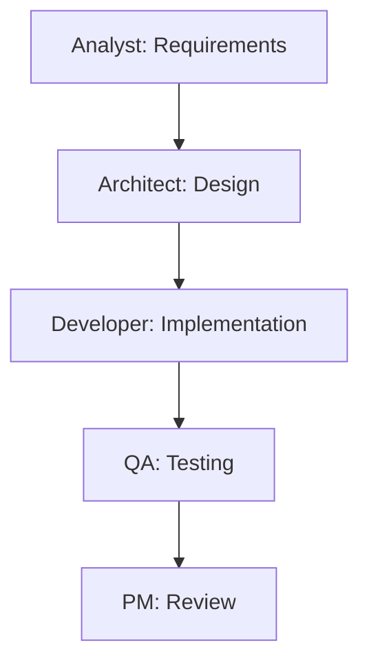

# BMAD Task Breakdown

## Agent Task Assignments

### 🔍 Analyst Tasks
- [ ] Gather requirements from stakeholders
- [ ] Document user stories
- [ ] Define acceptance criteria
- [ ] Create test scenarios

### 📊 PM Tasks
- [ ] Prioritize features
- [ ] Create sprint plan
- [ ] Track progress
- [ ] Coordinate agent activities

### 🏗️ Architect Tasks
- [ ] Design system architecture
- [ ] Create technical specifications
- [ ] Review code architecture
- [ ] Define integration points

### 💻 Developer Tasks
#### Setup
- [ ] Set up development environment
- [ ] Configure dependencies
- [ ] Create project structure

#### Implementation
- [ ] Implement feature 1
- [ ] Implement feature 2
- [ ] Implement feature 3

#### Testing
- [ ] Write unit tests
- [ ] Write integration tests
- [ ] Fix failing tests

#### Documentation
- [ ] Document API endpoints
- [ ] Update README
- [ ] Add code comments

### 🧪 QA Tasks
- [ ] Create test plan
- [ ] Execute test cases
- [ ] Report bugs
- [ ] Verify fixes
- [ ] Regression testing

## Task Dependencies

## Timeline
| Week | Tasks | Agent |
|------|-------|-------|
| 1 | Requirements, Design | Analyst, Architect |
| 2 | Implementation | Developer |
| 3 | Testing | QA |
| 4 | Review, Deploy | PM, Developer |

## Completion Checklist
- [ ] All requirements documented
- [ ] Architecture approved
- [ ] Code implemented
- [ ] Tests passing
- [ ] Documentation complete
- [ ] QA sign-off
- [ ] PM approval

---
*Tasks coordinated using BMAD multi-agent methodology.*