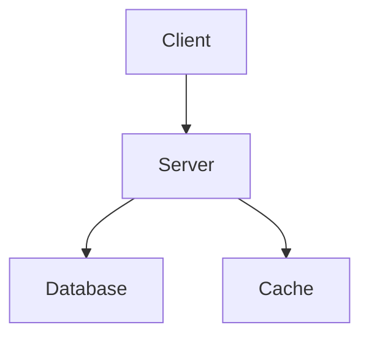

# Mermaid Diagram Validation

**Tool**: `lib/docs/mermaid.sh`
**Purpose**: Validate Mermaid diagrams in documentation for syntax, accessibility, and quality
**Status**: Production Ready

## Overview

The Mermaid validation tool ensures documentation diagrams are:
- ✅ Syntactically correct
- ✅ Accessible (screen reader compatible)
- ✅ Not overly complex
- ✅ Following best practices

## Quick Start

```bash
# Validate single file
./lib/docs/mermaid.sh README.md

# Validate directory
./lib/docs/mermaid.sh -d docs/

# Quiet mode with JSON output
./lib/docs/mermaid.sh -q -f json docs/*.md
```

## Features

### Validation Types
1. **Syntax Validation**
   - Balanced brackets/parentheses
   - Valid diagram type declarations
   - Quote consistency

2. **Accessibility Checks**
   - Title attributes: `%%{title: 'Description'}%%`
   - Description attributes: `%%{description: 'Detailed explanation'}%%`
   - Alt text in HTML comments

3. **Quality Checks**
   - Diagram complexity limits
   - Common error patterns
   - Best practice recommendations

### Supported Diagram Types
- `flowchart`, `graph` - Process flows
- `sequenceDiagram` - Interaction sequences
- `classDiagram` - Object relationships
- `stateDiagram` - State machines
- `erDiagram` - Entity relationships
- `gantt` - Project timelines
- `journey` - User journeys
- `pie` - Data visualization
- Plus: `gitgraph`, `requirement`, `mindmap`, `timeline`, `sankey`, `block`, `architecture`

## Integration with Documentation Workflows

### Pre-commit Hooks
```bash
# Add to .git/hooks/pre-commit
./lib/docs/mermaid.sh -d docs/ || exit 1
```

### CI/CD Pipeline
```yaml
# GitHub Actions example
- name: Validate Mermaid Diagrams
  run: ./lib/docs/mermaid.sh -f json docs/ > mermaid-validation.json
```

### Vale Integration
The tool can be integrated with Vale linting by adding Mermaid-specific rules.

## Configuration Options

| Flag | Description | Default |
|------|-------------|---------|
| `-v, --verbose` | Enable detailed output | false |
| `-q, --quiet` | Suppress non-error output | false |
| `-f, --format` | Output format (text\|json\|junit) | text |
| `-d, --directory` | Validate directory | single files |
| `-r, --recursive` | Recurse subdirectories | false |
| `--no-accessibility` | Skip accessibility checks | enabled |
| `--no-complexity` | Skip complexity checks | enabled |
| `--max-complexity N` | Set complexity limit | 50 |

## Accessibility Best Practices

### Required Attributes


### Alt Text in Comments
```mermaid
<!-- alt: Diagram showing data flow from user input through processing to storage -->
graph LR
    User --> Process --> Storage
```

## Error Reference

### Common Errors
- **Empty diagram block**: Mermaid code block with no content
- **Unbalanced brackets**: Missing `]` or `)`
- **Unknown diagram type**: First line doesn't match supported types
- **Unclosed quotes**: String literals not properly terminated

### Warnings
- **Missing accessibility title**: Add `%%{title: 'Description'}%%`
- **High complexity**: Consider breaking into multiple diagrams
- **Chained arrows**: May indicate missing intermediate nodes

## Dependencies

### Required (Full Validation)
- **Mermaid CLI**: `npm install -g @mermaid-js/mermaid-cli`
- **jq**: For JSON output formatting (optional)

### Fallback Mode
- Basic validation without Mermaid CLI
- Covers syntax and accessibility checks
- Reduced error detection capability

## Output Formats

### Text Output (Default)
```
=== Mermaid Validation Results ===
Total files processed: 3
Errors: 1
Warnings: 2

Issues found:
  docs/architecture.md:42:error:Unbalanced brackets
  docs/flows.md:15:warning:Missing accessibility title
```

### JSON Output
```json
{
  "validation_results": [
    {
      "file": "docs/architecture.md",
      "line": 42,
      "severity": "error",
      "message": "Unbalanced brackets: 3 '[' vs 2 ']'"
    }
  ],
  "summary": {
    "errors": 1,
    "warnings": 1
  }
}
```

### JUnit XML Output
Suitable for CI/CD integration and test reporting tools.

## Exit Codes

| Code | Meaning |
|------|---------|
| 0 | Success (no errors) |
| 1 | Validation errors found |
| 2 | Missing dependencies |
| 3 | Parse/file errors |
| 4 | Accessibility errors |

## Troubleshooting

### Performance Issues
- Large files: Use `--max-complexity` to limit checks
- Many files: Use `-r` for recursive directory validation

### False Positives
- Complex regex in diagrams may trigger quote warnings
- Custom node syntax may not be recognized

### Missing Mermaid CLI
- Install: `npm install -g @mermaid-js/mermaid-cli`
- Fallback mode provides basic validation
- Consider using Docker: `docker run -v $(pwd):/data minlag/mermaid-cli`

## Related Tools
- **Vale**: Documentation linting (`.vale.ini`)
- **Documentation drift detection**: `./scripts/check-drift.sh`
- **living-docs wizard**: `./wizard.sh`

---
*Part of living-docs documentation quality assurance system*