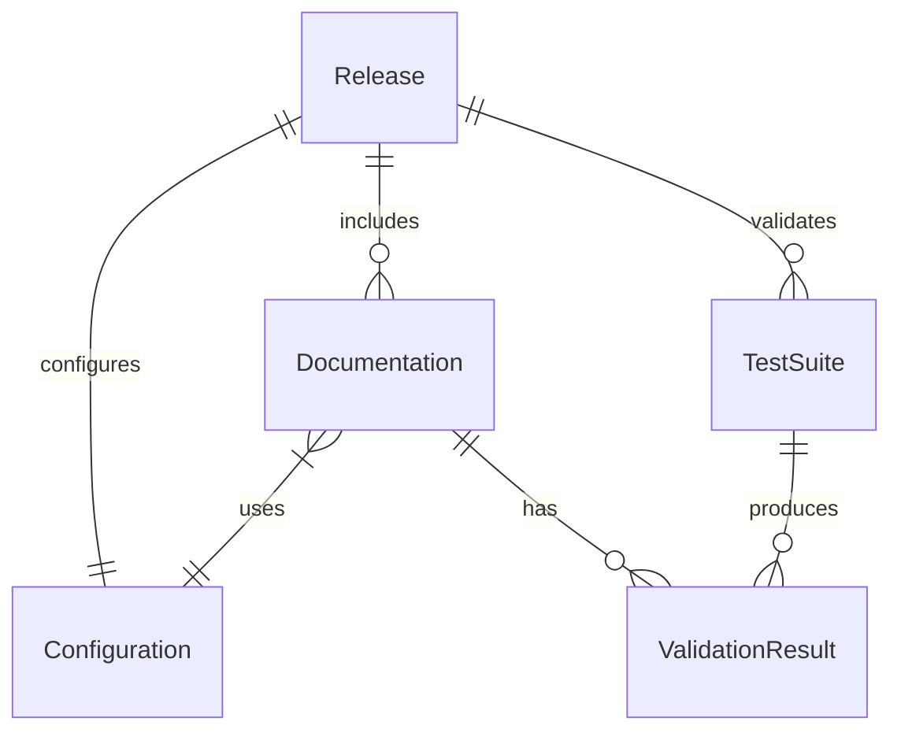

# Data Model: Security & Infrastructure Improvements

## Core Entities

### Release
**Purpose**: Represents a versioned distribution of living-docs
**Fields**:
- `version`: Semantic version string (e.g., "5.1.0")
- `tag`: Git tag reference
- `checksum`: SHA256 hash of release archive
- `signature`: GPG signature for verification
- `release_date`: ISO 8601 timestamp
- `changelog`: Array of change entries
- `breaking_changes`: Boolean flag
- `min_bash_version`: Minimum required bash version

**Validation Rules**:
- Version must follow semantic versioning
- Checksum must be 64 character hex string
- Signature must be valid GPG signature
- Breaking changes require major version bump

### Documentation
**Purpose**: Represents documentation files and their metadata
**Fields**:
- `path`: Relative path from project root
- `type`: Enum (markdown, yaml, xml, json)
- `last_modified`: Timestamp of last edit
- `checksum`: MD5 hash for drift detection
- `dependencies`: Array of referenced files
- `status`: Enum (active, archived, draft)
- `validations`: Array of validation results

**Validation Rules**:
- Path must exist in filesystem
- Type must match file extension
- Dependencies must be valid paths
- Checksum updated on every modification

### TestSuite
**Purpose**: Represents test execution and results
**Fields**:
- `id`: Unique identifier
- `name`: Test suite name
- `type`: Enum (unit, integration, contract, e2e)
- `files`: Array of test file paths
- `coverage`: Coverage percentage
- `status`: Enum (pending, running, passed, failed)
- `duration`: Execution time in milliseconds
- `failures`: Array of failure details

**Validation Rules**:
- Coverage must be >= 80%
- All test files must exist
- Failed tests block releases

### Configuration
**Purpose**: System and user configuration settings
**Fields**:
- `version`: Config schema version
- `frameworks`: Array of installed framework adapters
- `paths`: Object with customized paths
- `features`: Object with feature flags
- `debug_mode`: Boolean
- `dry_run`: Boolean
- `rollback_enabled`: Boolean
- `last_update`: Timestamp

**Validation Rules**:
- Version must be compatible with current system
- Paths must be valid and writable
- Feature flags must be known values

### ValidationResult
**Purpose**: Results from documentation and code validation
**Fields**:
- `target`: File or entity being validated
- `validator`: Tool or check performed
- `severity`: Enum (error, warning, info)
- `message`: Human-readable description
- `line`: Line number if applicable
- `suggestion`: Proposed fix if available
- `timestamp`: When validation occurred

**State Transitions**:
- `pending` → `validating` → `complete`
- `complete` → `acknowledged` (for warnings)
- `complete` → `fixed` → `revalidated`

## Relationships



## State Machines

### Release State Machine
```
draft → testing → candidate → released
         ↓         ↓
       failed   withdrawn
```

### Test Execution State Machine
```
idle → queued → running → complete
         ↓         ↓         ↓
      cancelled  timeout   failed
                            ↓
                          retrying
```

## File System Structure
```
.living-docs/
├── config.json         # Configuration entity
├── state.json          # Current system state
├── releases/
│   └── v5.1.0.json    # Release metadata
├── checksums/
│   └── manifest.txt    # Documentation checksums
├── backup/            # Rollback snapshots
│   └── v5.0.0/
└── logs/
    └── operations.log  # Debug/audit log
```

## Constraints
- All entities must be serializable to JSON
- File operations must be atomic (write to temp, then move)
- Checksums verified before any modification
- Backup created before any destructive operation
- All paths must be relative to project root